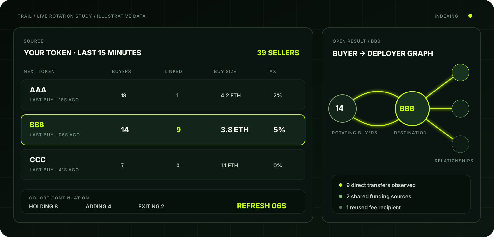
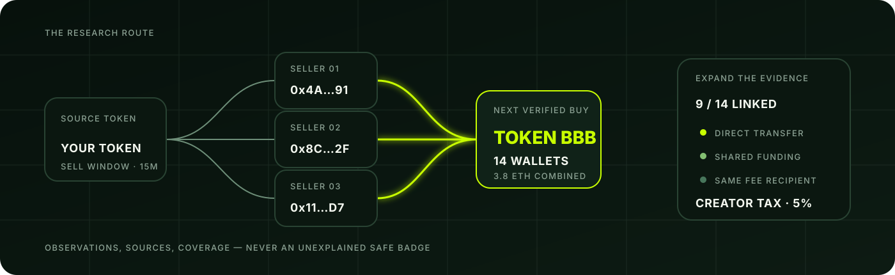

<p align="center">
  
</p>

<p align="center">
  
</p>

<h1 align="center">TRAIL</h1>

<p align="center">
  <strong>Follow the rotation. Check the connections.</strong><br/>
  See what a token's sellers bought next — and who stands behind those next tokens.
</p>

<p align="center">
  
  
  
  <a href="LICENSE"></a>
</p>

<p align="center">
  <a href="#the-product">Product</a> ·
  <a href="#the-workflow">Workflow</a> ·
  <a href="#what-each-result-shows">Evidence</a> ·
  <a href="#first-release">First release</a> ·
  <a href="docs/METHODOLOGY.md">Methodology</a>
</p>

---

## The product

**TRAIL is an onchain research workspace for wallet rotation on Robinhood Chain.**

Paste the contract address of a token you already follow. TRAIL finds wallets that sold it during a selected window, identifies their next genuine purchases, and opens the deployer and fee relationships behind every destination token.

The point is not to label a token `SAFE`. The point is to show the route, the participants, the observable links, and the missing data clearly enough for a trader to decide what deserves deeper research.

<p align="center">
  
</p>

## The thirty-second read

Start with one token. TRAIL answers three questions:

| Question | What TRAIL returns |
| --- | --- |
| **Who left?** | Wallets that sold the source token inside the selected lookback window |
| **Where did they go?** | Their next verified purchases, including time, size, and current position state |
| **Who is behind it?** | Deployer history, funding paths, fee recipient, creator tax, and observable links to buyers |

### Example output

All values below are illustrative.

| Next token | Buyers after exit | Linked to deployer | Combined buys | Creator tax |
| --- | ---: | ---: | ---: | ---: |
| `AAA` | 18 | 1 | 4.2 ETH | 2% |
| `BBB` | 14 | 9 | 3.8 ETH | 5% |
| `CCC` | 7 | 0 detected | 1.1 ETH | 0% |

Opening `BBB` reveals the route instead of hiding it behind a score:

```text
SOURCE TOKEN
  └─ sold by 14 wallets
       └─ next verified purchase: BBB
            ├─ 9 buyers have direct transfers with the BBB deployer
            ├─ combined purchase size: 3.8 ETH
            ├─ creator tax: 5%
            └─ current state: holding / accumulating / exiting
```

## The workflow

<p align="center">
  
</p>

1. **Paste a contract address.** Choose a lookback such as the last 15 minutes.
2. **Resolve sellers.** TRAIL records wallets that executed a sale; ordinary token transfers do not count as purchases or sales.
3. **Find the next purchase.** Each seller is followed forward to its next qualifying buy.
4. **Group the rotation.** Destination tokens are ranked by participating wallets and combined purchase size.
5. **Inspect the launch.** TRAIL expands deployer history, observed funding, fee recipients, creator tax, and buyer relationships.
6. **Keep watching.** The table updates as wallets hold, add, or exit.

## What each result shows

### Route

Source-token sale → next-token purchase, with transaction time, order, and amount.

### Origin

The destination token's deployer, previous observed launches, and available funding provenance.

### Concentration

Supply held by the deployer and by the selected group of observably connected wallets.

### Trading cost

Base fees and creator tax are displayed separately rather than compressed into one number.

### Continuation

Whether rotating wallets still hold the destination token, continue accumulating, or have started exiting.

### Connection labels

TRAIL uses literal evidence labels:

- `direct transfer`
- `shared funding source`
- `same fee recipient`

A shared funding source does **not** prove common ownership. No detected connection does **not** prove independence. See the full [methodology and evidence boundaries](docs/METHODOLOGY.md).

## Why the ant?

The ant is small, persistent, and useful because it follows a trail that is almost invisible on its own. One wallet movement is noise. A coordinated route across sellers, next purchases, deployers, and fee recipients becomes a pattern.

That is TRAIL's job: follow every step and bring the pattern back intact.

## First release

The first implementation is intentionally narrow:

- contract-address search;
- selectable seller lookback;
- live table of next verified purchases;
- expandable buyer-to-deployer graph;
- deployer launch and funding history;
- base fee and creator-tax separation;
- hold / add / exit continuation state;
- subscriptions for material changes;
- explicit data coverage and timestamps.

Performance claims will be published only after reproducible measurements. The product will not promise a fixed response time such as `50 ms` before it is benchmarked.

## Project map

```text
.github/                Issue and pull-request templates
assets/                 Brand, mascot, diagrams, and interface studies
config/                 Runtime configuration contract and secret boundaries
data/                   Dataset, fixture, and provenance conventions
docs/                   Product, architecture, methodology, and roadmap
examples/               Illustrative API and rotation-result payloads
scripts/                Repeatable development and data-maintenance tasks
src/
  api/                   Read-only query surface
  chain/                 Robinhood Chain access and normalization
  events/                Sale and purchase classification
  relationships/        Deployer, funding, and fee evidence
  rotation/             Seller-to-next-purchase sequencing
  storage/               Indexed history and provenance
  ui/                    Table, graph, and evidence-card views
tests/                   Unit, integration, and fixture conventions
```

Each directory currently defines a clear ownership boundary before implementation begins. See [architecture](docs/ARCHITECTURE.md) for the intended data flow and [data model](docs/DATA_MODEL.md) for the evidence contract.

## Status

This repository currently contains the product specification and original visual system for TRAIL. The implementation will be added in measurable stages described in the [roadmap](docs/ROADMAP.md). Screens and numbers in the current documentation are interface studies, not live trading signals.

## Safety boundary

TRAIL is a research tool, not financial advice, a custody product, or a transaction signer. It reports observable onchain activity and data coverage; it does not prove identity, ownership, coordination, or token safety.

---

<p align="center">
  <strong>Built for following movement, not manufacturing certainty.</strong>
</p>
