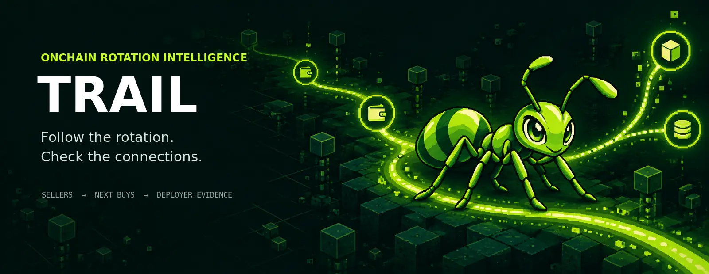

<p align="center">
  
</p>

<p align="center">
  
</p>

<h1 align="center">TRAIL</h1>

<p align="center"><strong>Follow the money after it leaves.</strong></p>

<p align="center">
  Read-only wallet rotation intelligence for Robinhood Chain.
  <br />
  Find what confirmed sellers bought next — then inspect the evidence around the destination token.
</p>

<p align="center">
  <a href="https://trail-wallet-intelligence.teamconfluence.chatgpt.site">OPEN LIVE SCANNER ↗</a>
  ·
  <a href="https://x.com/doublenickk">X / @DOUBLENICKK ↗</a>
</p>

<p align="center">
  
  
  
  
</p>

---

## What TRAIL does

TRAIL is a research-first scanner for wallet rotation on Robinhood Chain. Paste a token contract, choose a seller window, and the live scanner follows a strict evidence path:

`source token → confirmed seller → next confirmed purchase → destination origin → deployer relationship`

The product is designed to expose a route, not manufacture a confidence score. It does not sign transactions, custody funds, or call a token safe.

## The live product

The [TRAIL scanner](https://trail-wallet-intelligence.teamconfluence.chatgpt.site) currently provides:

- contract-address input with a selectable lookback window;
- indexed source-token transfers from Blockscout;
- qualifying seller detection based on wallet-level token flow;
- confirmed next-purchase discovery;
- destination grouping by token and buyer cohort;
- current holding checks when the indexer exposes a balance;
- deployer-origin lookup;
- direct buyer ↔ deployer transaction evidence;
- coverage, timestamps, and explicit missing-data states;
- a copyable evidence report.

A zero-result scan is a valid observation. It means no route matched the strict rules in that window; it is never replaced with random or illustrative values.

## Evidence model

TRAIL separates observations from conclusions.

| Layer | Meaning |
| --- | --- |
| **Source transfer** | Indexed movement involving the source token |
| **Qualified sale** | Net source-token outflow plus receipt of another asset in a confirmed transaction |
| **Next purchase** | A later confirmed transaction with token outflow and receipt of a non-quote token |
| **Holding state** | Balance result returned by the indexer at scan time |
| **Deployer link** | Literal direct transaction match between a selected buyer and destination deployer |
| **Coverage** | What was inspected, what was capped, and what was unavailable |

TRAIL never claims that a shared funding source proves common ownership. It never claims that a missing link proves independence. It never infers safety, intent, profitability, or identity.

## Workflow

1. **Enter a contract.** Use a full `0x` address on Robinhood Chain.
2. **Choose the window.** Start with 15 minutes for a focused scan; expand when coverage is thin.
3. **Read the seller cohort.** The scanner checks indexed token movement and reconstructs wallet-level flows.
4. **Follow the next purchase.** Only a later qualifying swap is shown as a next purchase.
5. **Open a destination row.** Inspect buyer count, amount, holdings, deployer, and direct links.
6. **Copy the report.** Export the selected evidence trail for further research.

## Architecture

```text
Browser
  └─ POST /api/scan
       └─ Cloudflare Worker
            ├─ validate contract + window
            ├─ fetch token + transfer pages
            ├─ inspect confirmed transaction flows
            ├─ follow selected wallets forward
            ├─ resolve destination origin
            ├─ check balances and direct links
            └─ return live_onchain JSON + coverage

Blockscout API
  └─ Robinhood Chain / 4663
```

The API credential is held as a server-side Site secret. It is never embedded in the browser bundle. The client receives only the normalized response needed to render the table and evidence panel.

## Repository map

```text
.github/
  ISSUE_TEMPLATE/              Bug and feature intake
  workflows/                   Validation and documentation checks
  pull_request_template.md     Review contract

api/                           Request and response contracts
chain/                         Robinhood Chain adapters and normalization
config/                        Public configuration shape and secret boundaries
data/
  schemas/                     Evidence and result schemas
  provenance/                  Source and timestamp conventions
docs/
  API.md                       Scanner endpoint contract
  ARCHITECTURE.md              System boundaries and data flow
  DATA_MODEL.md                Evidence entities and relationships
  METHODOLOGY.md               Sale and purchase definitions
  OPERATIONS.md                Rate limits, caching, and incident notes
  ROADMAP.md                   Measurable product stages
events/                        Confirmed event classification
examples/                      Live-response and empty-result examples
fixtures/                      Sanitized transaction fixtures
observability/                 Health, coverage, and diagnostics notes
relationships/                 Deployer, funding, and fee evidence
rotation/                      Seller-to-next-purchase sequencing
scripts/                       Repeatable maintenance commands
src/
  ingestion/                   Indexed data ingestion
  normalization/               Address, token, and amount normalization
  queries/                     Read-only query services
  telemetry/                   Coverage and scan-status events
  ui/                          Table, graph, and evidence components
storage/                       Provenance and indexed history boundaries
tests/
  fixtures/                    Deterministic test inputs
  integration/                 API contract checks
  unit/                        Classification checks
ui/                            Product surface and visual system
```

Every directory exists for a concrete ownership boundary. Placeholder folders are avoided; each new area contains a short contract or README explaining what belongs there.

## Data boundaries

- **Network:** Robinhood Chain, chain ID `4663`.
- **Source:** Blockscout indexed transactions and token transfers.
- **Mode:** read-only; no wallet connection and no signer.
- **Credentials:** runtime secret only; never commit API keys.
- **Response state:** live, capped, empty, or unavailable — never fabricated.
- **Limit:** indexed data can be incomplete or delayed; the UI exposes coverage instead of hiding it.

## Development principles

1. Preserve transaction order and timestamps.
2. Distinguish swaps from ordinary transfers.
3. Keep source links and missing-data flags visible.
4. Prefer a smaller confirmed result to a larger guessed result.
5. Keep visual telemetry tied to a real product state.
6. Do not turn onchain observations into financial advice.

## Roadmap

### Current

- live contract scanner;
- strict seller and next-purchase rules;
- destination evidence table;
- deployer origin and direct-link checks;
- responsive TRAIL visual system.

### Next

- deeper native-asset flow classification;
- persistent indexed history;
- reproducible integration fixtures;
- richer funding and fee-recipient graph;
- saved scans and change tracking.

### Later

- authenticated workspaces;
- scheduled monitoring;
- exportable investigation bundles;
- additional indexed network adapters.

## Safety

TRAIL is an onchain research interface. It is not a trading system, financial adviser, custody product, or transaction signer. A route is an observation to investigate — not a guarantee of safety or return.

## Contributing

Keep pull requests narrow and evidence-backed:

1. explain the user-visible behavior;
2. include the data definition being changed;
3. add or update a deterministic fixture;
4. document coverage and failure states;
5. avoid credentials, fabricated numbers, and hidden inference.

Open a focused issue before larger changes. Keep the dark green/lime visual language consistent across docs, UI, and diagrams.

---

<p align="center"><strong>Built for following movement, not manufacturing certainty.</strong></p>
